# SUPRA-MAP — the canon constellation (generated)

> **Generated by `tools/graph-canon.mjs` — do not edit by hand.** Regenerate after
> adding or changing a canon: `node tools/graph-canon.mjs`. Nodes are canon spines
> (labelled with their ADOPT piece number); edges are the **companion/sibling
> relationships each canon declares in its header** (curated, not every mention).
> 45 spines · 106 declared relationships.

```mermaid
flowchart LR
  subgraph ai_agents["ai-agents (how agents work)"]
    CANON_ARCHITECTURE_REVIEW["#24 architecture review"]
    CANON_CODER_ORCHESTRATION_001["#36 coder orchestration"]
    CANON_CODER_SAFE_IDENTITY_001["#35 coder safe identity"]
    CANON_COMM_INTERNAL_VS_EXTERNAL_001["comm internal vs external"]
    CANON_CONTEXT_HYGIENE["#20 context hygiene"]
    CANON_CROSS_AGENT_CONTEXT_LAYERING["#2 cross agent context layering"]
    CANON_MULTI_AGENT_ORCHESTRATION["#4 multi agent orchestration"]
    CANON_OBSERVABILITY_CLOSED_LOOP_001["observability closed loop"]
    CANON_RUNTIME_POLICY_ENGINE_001["#40 runtime policy engine"]
    CANON_SKILLS_OVER_ROLES["#19 skills over roles"]
  end
  subgraph methodology["methodology (how work is done)"]
    CANON_AGENT_COLLABORATION["#17 agent collaboration"]
    CANON_AGENT_SCOPE_DISCIPLINE["#18 agent scope discipline"]
    CANON_AUDIT_PROTOCOL["#25 audit protocol"]
    CANON_BRANCH_WORKTREE_LIFECYCLE["#23 branch worktree lifecycle"]
    CANON_CHANGE_PATH_AND_DECISION_CLASSES_001["#37 change path and decision classes"]
    CANON_CONFIGURATION_DISCIPLINE["#32 configuration discipline"]
    CANON_DATA_CHANGE_AUDIT_001["#43 data change audit"]
    CANON_DATA_JURISDICTION_RESOLUTION_001["#55 data jurisdiction resolution"]
    CANON_DATA_LEGAL_COMPLIANCE_001["#44 data legal compliance"]
    CANON_DATA_SOFT_DELETE_001["#54 data soft delete"]
    CANON_DB_SECURITY_BASELINE_001["#38 db security baseline"]
    CANON_DEV_MODE_DISCIPLINE["#21 dev mode discipline"]
    CANON_DEVELOPMENT_PROCESS["#10a development process"]
    CANON_DOCUMENTATION_ARTIFACT_STANDARDS_001["#45 documentation artifact standards"]
    CANON_E2E_TEST_USER_DISCIPLINE["#27 e2e test user discipline"]
    CANON_GAP_REPORT["#28 gap report"]
    CANON_GIT_HYGIENE["#22 git hygiene"]
    CANON_HUMAN_SURFACE_LEGIBILITY_001["#39 human surface legibility"]
    CANON_IDENTITY_PROVISIONING_INTEGRITY_001["#51 identity provisioning integrity"]
    CANON_KNOWLEDGE_NATIVE_VT_METHOD_001["#49 knowledge native vt method"]
    CANON_NAMING_CONVENTIONS_001["#13 naming conventions"]
    CANON_PORT_ASSIGNMENT_001["#41 port assignment"]
    CANON_PRODUCTION_SAFETY["#30 production safety"]
    CANON_STATE_MIRROR_AND_DECISION_REGISTER_001["#34 state mirror and decision register"]
    CANON_SYSTEM_MIGRATION_DISCIPLINE_001["#47 system migration discipline"]
    CANON_TESTING_GATE["#26 testing gate"]
    CANON_TESTING_MINIMUM_BAR_001["#15 testing minimum bar"]
    CANON_UI_PREFERENCE_PERSISTENCE_001["#48 ui preference persistence"]
    CANON_VERSIONING_001["#16 versioning"]
    CANON_VISUAL_BUG_TRIAGE_001["#14 visual bug triage"]
    VT_METHOD["#10b vt method"]
  end
  subgraph architecture["architecture (structure & inheritance)"]
    CANON_DECISION_DISPOSITION_FOR_GRAPH_INDEXING["#5 decision disposition for graph indexing"]
    CANON_UPSTREAM_PROTOCOL["#29 upstream protocol"]
    CANON_VERTICAL_BOUNDARY_001["vertical boundary"]
    CANON_VERTICAL_UI_INHERITANCE_001["vertical ui inheritance"]
  end
  CANON_ARCHITECTURE_REVIEW --- CANON_TESTING_GATE
  CANON_ARCHITECTURE_REVIEW --- CANON_DEV_MODE_DISCIPLINE
  CANON_CODER_ORCHESTRATION_001 --- CANON_CODER_SAFE_IDENTITY_001
  CANON_CODER_ORCHESTRATION_001 --- CANON_MULTI_AGENT_ORCHESTRATION
  CANON_CODER_ORCHESTRATION_001 --- CANON_BRANCH_WORKTREE_LIFECYCLE
  CANON_CODER_ORCHESTRATION_001 --- CANON_GIT_HYGIENE
  CANON_CODER_ORCHESTRATION_001 --- CANON_STATE_MIRROR_AND_DECISION_REGISTER_001
  CANON_CODER_ORCHESTRATION_001 --- CANON_SKILLS_OVER_ROLES
  CANON_CODER_SAFE_IDENTITY_001 --- CANON_BRANCH_WORKTREE_LIFECYCLE
  CANON_CODER_SAFE_IDENTITY_001 --- CANON_GIT_HYGIENE
  CANON_CODER_SAFE_IDENTITY_001 --- CANON_CONFIGURATION_DISCIPLINE
  CANON_CODER_SAFE_IDENTITY_001 --- CANON_MULTI_AGENT_ORCHESTRATION
  CANON_CODER_SAFE_IDENTITY_001 --- CANON_SKILLS_OVER_ROLES
  CANON_CONTEXT_HYGIENE --- CANON_CROSS_AGENT_CONTEXT_LAYERING
  CANON_CONTEXT_HYGIENE --- CANON_MULTI_AGENT_ORCHESTRATION
  CANON_CONTEXT_HYGIENE --- CANON_DEVELOPMENT_PROCESS
  CANON_MULTI_AGENT_ORCHESTRATION --- CANON_DEVELOPMENT_PROCESS
  CANON_MULTI_AGENT_ORCHESTRATION --- CANON_CROSS_AGENT_CONTEXT_LAYERING
  CANON_OBSERVABILITY_CLOSED_LOOP_001 --- CANON_MULTI_AGENT_ORCHESTRATION
  CANON_OBSERVABILITY_CLOSED_LOOP_001 --- CANON_RUNTIME_POLICY_ENGINE_001
  CANON_OBSERVABILITY_CLOSED_LOOP_001 --- CANON_AUDIT_PROTOCOL
  CANON_RUNTIME_POLICY_ENGINE_001 --- CANON_CODER_ORCHESTRATION_001
  CANON_RUNTIME_POLICY_ENGINE_001 --- CANON_MULTI_AGENT_ORCHESTRATION
  CANON_RUNTIME_POLICY_ENGINE_001 --- CANON_DEVELOPMENT_PROCESS
  CANON_SKILLS_OVER_ROLES --- CANON_MULTI_AGENT_ORCHESTRATION
  CANON_SKILLS_OVER_ROLES --- CANON_AGENT_SCOPE_DISCIPLINE
  CANON_SKILLS_OVER_ROLES --- CANON_AGENT_COLLABORATION
  CANON_AGENT_COLLABORATION --- CANON_CODER_ORCHESTRATION_001
  CANON_AGENT_COLLABORATION --- CANON_DEVELOPMENT_PROCESS
  CANON_AGENT_COLLABORATION --- VT_METHOD
  CANON_AGENT_COLLABORATION --- CANON_MULTI_AGENT_ORCHESTRATION
  CANON_AGENT_COLLABORATION --- CANON_UPSTREAM_PROTOCOL
  CANON_AGENT_COLLABORATION --- CANON_GIT_HYGIENE
  CANON_AGENT_SCOPE_DISCIPLINE --- CANON_AGENT_COLLABORATION
  CANON_AGENT_SCOPE_DISCIPLINE --- CANON_MULTI_AGENT_ORCHESTRATION
  CANON_AGENT_SCOPE_DISCIPLINE --- CANON_CROSS_AGENT_CONTEXT_LAYERING
  CANON_AUDIT_PROTOCOL --- CANON_ARCHITECTURE_REVIEW
  CANON_AUDIT_PROTOCOL --- CANON_DEVELOPMENT_PROCESS
  CANON_BRANCH_WORKTREE_LIFECYCLE --- CANON_GIT_HYGIENE
  CANON_BRANCH_WORKTREE_LIFECYCLE --- CANON_MULTI_AGENT_ORCHESTRATION
  CANON_BRANCH_WORKTREE_LIFECYCLE --- CANON_NAMING_CONVENTIONS_001
  CANON_CHANGE_PATH_AND_DECISION_CLASSES_001 --- CANON_DEVELOPMENT_PROCESS
  CANON_CHANGE_PATH_AND_DECISION_CLASSES_001 --- CANON_CODER_ORCHESTRATION_001
  CANON_CHANGE_PATH_AND_DECISION_CLASSES_001 --- CANON_TESTING_GATE
  CANON_CHANGE_PATH_AND_DECISION_CLASSES_001 --- CANON_VERSIONING_001
  CANON_CHANGE_PATH_AND_DECISION_CLASSES_001 --- CANON_AGENT_COLLABORATION
  CANON_CHANGE_PATH_AND_DECISION_CLASSES_001 --- CANON_STATE_MIRROR_AND_DECISION_REGISTER_001
  CANON_CHANGE_PATH_AND_DECISION_CLASSES_001 --- CANON_AUDIT_PROTOCOL
  CANON_CONFIGURATION_DISCIPLINE --- CANON_PRODUCTION_SAFETY
  CANON_DATA_CHANGE_AUDIT_001 --- CANON_DB_SECURITY_BASELINE_001
  CANON_DATA_CHANGE_AUDIT_001 --- CANON_STATE_MIRROR_AND_DECISION_REGISTER_001
  CANON_DATA_JURISDICTION_RESOLUTION_001 --- CANON_CONFIGURATION_DISCIPLINE
  CANON_DATA_JURISDICTION_RESOLUTION_001 --- CANON_DATA_LEGAL_COMPLIANCE_001
  CANON_DATA_LEGAL_COMPLIANCE_001 --- CANON_DATA_CHANGE_AUDIT_001
  CANON_DATA_LEGAL_COMPLIANCE_001 --- CANON_DB_SECURITY_BASELINE_001
  CANON_DATA_SOFT_DELETE_001 --- CANON_DATA_CHANGE_AUDIT_001
  CANON_DATA_SOFT_DELETE_001 --- CANON_DEV_MODE_DISCIPLINE
  CANON_DATA_SOFT_DELETE_001 --- CANON_DATA_LEGAL_COMPLIANCE_001
  CANON_DATA_SOFT_DELETE_001 --- CANON_SYSTEM_MIGRATION_DISCIPLINE_001
  CANON_DB_SECURITY_BASELINE_001 --- CANON_PRODUCTION_SAFETY
  CANON_DB_SECURITY_BASELINE_001 --- CANON_VERTICAL_BOUNDARY_001
  CANON_DB_SECURITY_BASELINE_001 --- CANON_TESTING_GATE
  CANON_DEV_MODE_DISCIPLINE --- CANON_AGENT_COLLABORATION
  CANON_DEVELOPMENT_PROCESS --- CANON_CROSS_AGENT_CONTEXT_LAYERING
  CANON_DOCUMENTATION_ARTIFACT_STANDARDS_001 --- CANON_VERSIONING_001
  CANON_DOCUMENTATION_ARTIFACT_STANDARDS_001 --- CANON_NAMING_CONVENTIONS_001
  CANON_DOCUMENTATION_ARTIFACT_STANDARDS_001 --- CANON_DEVELOPMENT_PROCESS
  CANON_DOCUMENTATION_ARTIFACT_STANDARDS_001 --- CANON_DECISION_DISPOSITION_FOR_GRAPH_INDEXING
  CANON_E2E_TEST_USER_DISCIPLINE --- CANON_AGENT_SCOPE_DISCIPLINE
  CANON_GAP_REPORT --- CANON_AGENT_COLLABORATION
  CANON_HUMAN_SURFACE_LEGIBILITY_001 --- CANON_MULTI_AGENT_ORCHESTRATION
  CANON_HUMAN_SURFACE_LEGIBILITY_001 --- CANON_CONTEXT_HYGIENE
  CANON_HUMAN_SURFACE_LEGIBILITY_001 --- CANON_AUDIT_PROTOCOL
  CANON_IDENTITY_PROVISIONING_INTEGRITY_001 --- CANON_CODER_SAFE_IDENTITY_001
  CANON_IDENTITY_PROVISIONING_INTEGRITY_001 --- CANON_DB_SECURITY_BASELINE_001
  CANON_IDENTITY_PROVISIONING_INTEGRITY_001 --- CANON_DATA_CHANGE_AUDIT_001
  CANON_KNOWLEDGE_NATIVE_VT_METHOD_001 --- VT_METHOD
  CANON_KNOWLEDGE_NATIVE_VT_METHOD_001 --- CANON_DEVELOPMENT_PROCESS
  CANON_KNOWLEDGE_NATIVE_VT_METHOD_001 --- CANON_CONTEXT_HYGIENE
  CANON_KNOWLEDGE_NATIVE_VT_METHOD_001 --- CANON_DECISION_DISPOSITION_FOR_GRAPH_INDEXING
  CANON_KNOWLEDGE_NATIVE_VT_METHOD_001 --- CANON_DOCUMENTATION_ARTIFACT_STANDARDS_001
  CANON_KNOWLEDGE_NATIVE_VT_METHOD_001 --- CANON_VERSIONING_001
  CANON_NAMING_CONVENTIONS_001 --- CANON_VERSIONING_001
  CANON_NAMING_CONVENTIONS_001 --- CANON_DECISION_DISPOSITION_FOR_GRAPH_INDEXING
  CANON_PORT_ASSIGNMENT_001 --- CANON_CONFIGURATION_DISCIPLINE
  CANON_PRODUCTION_SAFETY --- CANON_DEV_MODE_DISCIPLINE
  CANON_PRODUCTION_SAFETY --- CANON_GIT_HYGIENE
  CANON_PRODUCTION_SAFETY --- CANON_ARCHITECTURE_REVIEW
  CANON_STATE_MIRROR_AND_DECISION_REGISTER_001 --- CANON_AGENT_COLLABORATION
  CANON_STATE_MIRROR_AND_DECISION_REGISTER_001 --- CANON_DEVELOPMENT_PROCESS
  CANON_STATE_MIRROR_AND_DECISION_REGISTER_001 --- CANON_CONTEXT_HYGIENE
  CANON_STATE_MIRROR_AND_DECISION_REGISTER_001 --- CANON_AUDIT_PROTOCOL
  CANON_SYSTEM_MIGRATION_DISCIPLINE_001 --- CANON_DATA_CHANGE_AUDIT_001
  CANON_SYSTEM_MIGRATION_DISCIPLINE_001 --- CANON_DATA_LEGAL_COMPLIANCE_001
  CANON_SYSTEM_MIGRATION_DISCIPLINE_001 --- CANON_DB_SECURITY_BASELINE_001
  CANON_TESTING_MINIMUM_BAR_001 --- CANON_VISUAL_BUG_TRIAGE_001
  CANON_TESTING_MINIMUM_BAR_001 --- CANON_DEVELOPMENT_PROCESS
  CANON_UI_PREFERENCE_PERSISTENCE_001 --- CANON_CONFIGURATION_DISCIPLINE
  CANON_UI_PREFERENCE_PERSISTENCE_001 --- CANON_PRODUCTION_SAFETY
  CANON_VERSIONING_001 --- CANON_DECISION_DISPOSITION_FOR_GRAPH_INDEXING
  CANON_VERSIONING_001 --- CANON_DEVELOPMENT_PROCESS
  VT_METHOD --- CANON_DEVELOPMENT_PROCESS
  CANON_DECISION_DISPOSITION_FOR_GRAPH_INDEXING --- CANON_CROSS_AGENT_CONTEXT_LAYERING
  CANON_UPSTREAM_PROTOCOL --- CANON_DECISION_DISPOSITION_FOR_GRAPH_INDEXING
  CANON_VERTICAL_UI_INHERITANCE_001 --- CANON_VERTICAL_BOUNDARY_001
  CANON_VERTICAL_UI_INHERITANCE_001 --- CANON_NAMING_CONVENTIONS_001
```

**Legend.** `#N` = its piece in [`setup/ADOPT-DEV-KIT.md`](../setup/ADOPT-DEV-KIT.md).
Grouped by `knowledge/` domain. An edge = "these two canons explicitly reference each
other as companions/siblings" — the seams where one canon says *that concern is owned
there, not here*.

_Spines with no declared header relationship (standalone): comm internal vs external._
