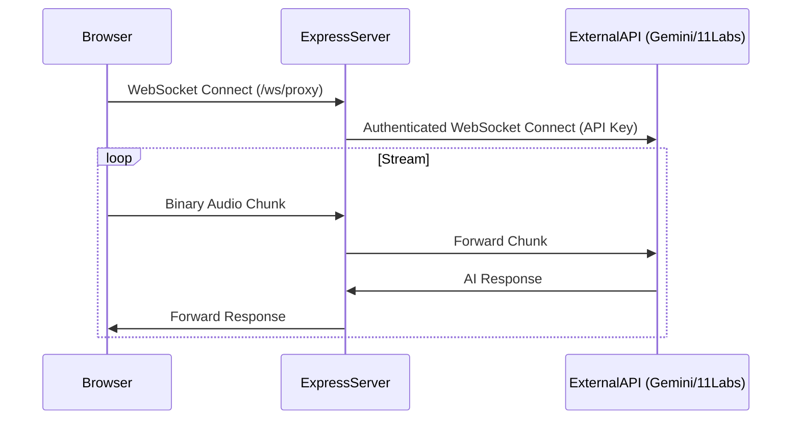

# Provider Integration Patterns

**Status:** Harvested from `v3-andres-cantor-fdp-voice-agent`
**Category:** Voice Architecture

## 1. The Backend Proxy Pattern

**Rule:** NEVER expose API keys (Gemini, ElevenLabs, Ultravox) in the client/browser.

### Architecture


### Implementation (Node.js/ws)

From `server/routes/gemini.js`:

```javascript
// Attach WebSocket Server
const attachGeminiWss = (server) => {
  const wss = new WebSocket.Server({ noServer: true });

  // 1. Intercept Upgrade
  server.on('upgrade', (request, socket, head) => {
    if (request.url === '/ws/gemini') {
      wss.handleUpgrade(request, socket, head, (ws) => {
        wss.emit('connection', ws, request);
      });
    }
  });

  // 2. Handle Connection
  wss.on('connection', (wsClient) => {
    // 3. Connect Upstream (with Key)
    const wsUpstream = new WebSocket(
      'wss://generativelanguage.googleapis.com/...',
      { headers: { 'x-goog-api-key': process.env.GEMINI_API_KEY } }
    );

    // 4. Pipe Data
    wsClient.on('message', (data) => wsUpstream.send(data));
    wsUpstream.on('message', (data) => wsClient.send(data));
  });
};
```

## 2. Ultravox Specifics

**Official Library:** `ultravox-client`
**Hooks Strategy:** Service-based encapsulation.

Don't use the SDK directly in components. Wrap it in a `UltravoxService` and expose a `useUltravox` hook.

## 3. Connection State Management

Always map your connection states to a finite list:
1.  `idle` (Disconnected)
2.  `connecting` (Handshake)
3.  `connected` (Ready to speak)
4.  `speaking` (AI is talking)
5.  `listening` (User is talking)
6.  `error` (Failed)

**UI Feedback:**
-   **Idle:** Gray microphone
-   **Listening:** Pulsing ring
-   **Speaking:** Waveform visualizer
